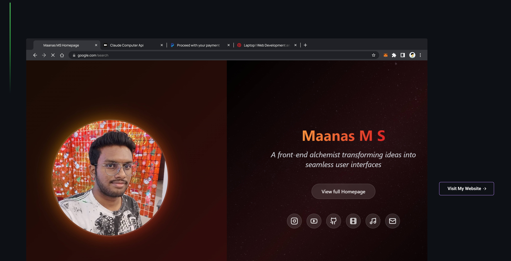

## Hi there :wave:

## 🔭  I am learning:

## GitHub Stats 📊

  
  
  

## 📈 Contribution Graph

## ⚡ Tech Stack

### 🚀 Languages

### 🧩 Libraries & Framework

### 🧑🏻‍💻 Tools & Platform

## 🎵 Now Playing

[]
## Profile Views 👀

## Get In Touch 🤝

  

<!--
**elementaryrock/elementaryrock** is a ✨ _special_ ✨ repository because its `README.md` (this file) appears on your GitHub profile.

Here are some ideas to get you started:

- 👯 I’m looking to collaborate on ...
- 🤔 I’m looking for help with ...
- 💬 Ask me about ...
- 📫 How to reach me: ...
- 😄 Pronouns: ...
- ⚡ Fun fact: ...
-->
